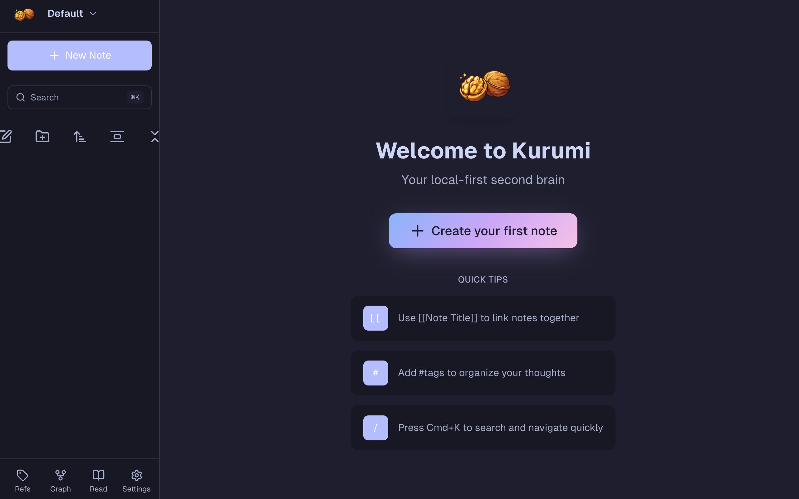
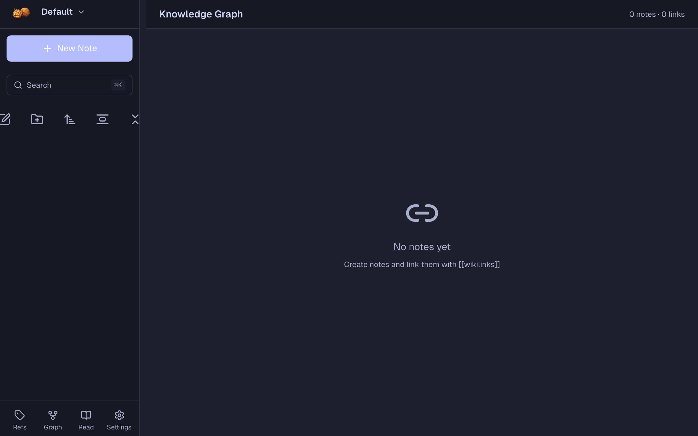
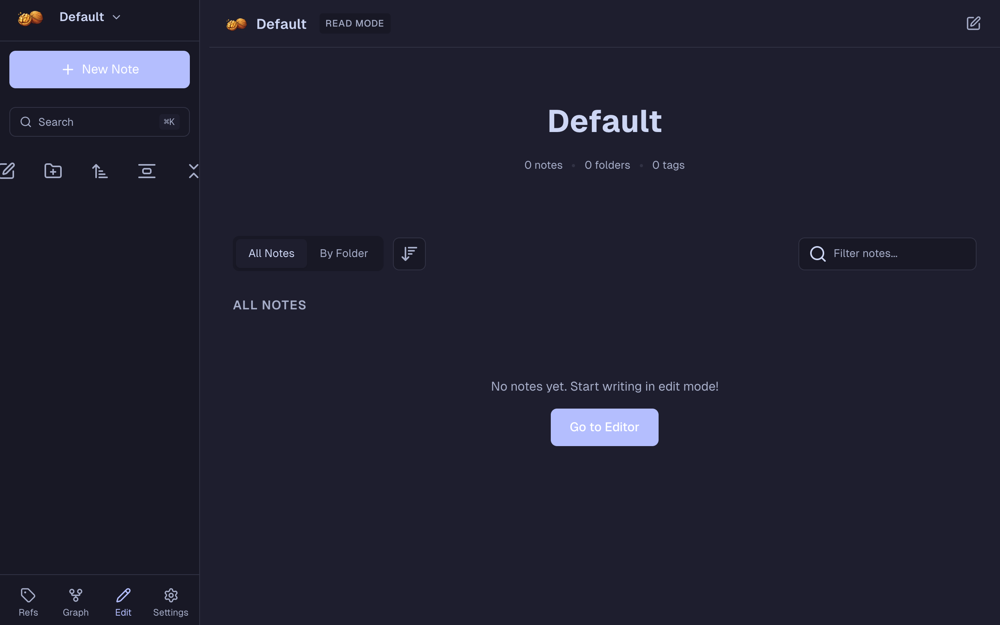
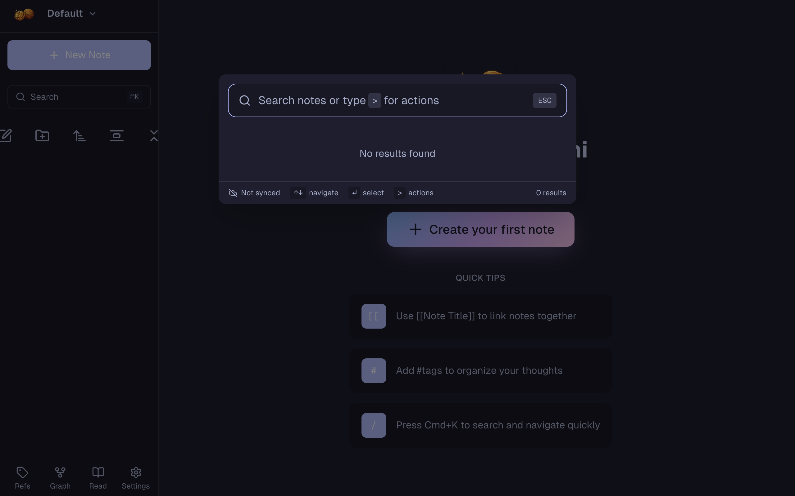

<div align="center">

<h1 align="center">
  
  <br>
  Kurumi
</h1>

<p align="center">
  <em>A local-first second brain.</em><br>
  <em>Your ideas, everywhere, offline.</em>
</p>

<p align="center">
  <a href="https://svelte.dev/">
    
  </a>
  <a href="https://automerge.org/">
    
  </a>
  <a href="LICENSE">
    
  </a>
</p>

<p align="center">
  <a href="#features">Features</a> •
  <a href="#installation">Installation</a> •
  <a href="#usage">Usage</a> •
  <a href="#sync-setup">Sync Setup</a> •
  <a href="#philosophy">Philosophy</a>
</p>

<hr />

</div>

Kurumi (クルミ, "walnut" in Japanese - because it looks like a brain) is a personal knowledge management system built for the way you actually think: connected, non-linear, and always available.

It's designed for:
- **Capturing ideas** instantly, from any device
- **Connecting thoughts** through wikilinks, tags, and @mentions
- **Working offline** with full functionality
- **Owning your data** with local-first architecture
- **AI assistance** to refine and improve your writing

---

## Screenshots

<div align="center">

<table>
<tr>
<td align="center"><strong>Editor</strong></td>
<td align="center"><strong>Graph View</strong></td>
</tr>
<tr>
<td></td>
<td></td>
</tr>
<tr>
<td align="center"><strong>Read Mode</strong></td>
<td align="center"><strong>Command Palette</strong></td>
</tr>
<tr>
<td></td>
<td></td>
</tr>
</table>

</div>

---

## Features

### Core

| Feature | Description |
|---------|-------------|
| **Vaults** | Organize notes into separate workspaces with custom icons |
| **Wikilinks** | Link notes with `[[Note Title]]` syntax and autocomplete |
| **Backlinks** | See all notes that link to the current note |
| **Graph View** | Interactive visualization of note connections |
| **Full-text Search** | Find anything instantly with Cmd+K |
| **Folders** | Organize notes hierarchically with drag-and-drop |
| **Tags** | Extract and filter by #hashtags |
| **@Mentions** | Reference people with @name syntax |
| **#Dates** | Reference dates with #2024-01-15 syntax |

### Read Mode

A distraction-free reading experience for your notes:
- Clean, blog-style article layout
- Browse by folder, tag, person, or date
- Quick navigation between notes
- One-click switch to edit mode

### AI Assistant

Powered by OpenAI or Anthropic (bring your own API key):
- **Improve** - Fix grammar, clarity, and flow
- **Expand** - Add detail and elaboration
- **Summarize** - Condense to key points
- **Simplify** - Make text easier to understand
- **Translate** - Convert to any language

### Customization

| Feature | Description |
|---------|-------------|
| **Themes** | Light, dark, and system (Catppuccin palette) |
| **Editor Font** | iA Writer Quattro S or Geist |
| **Font Size** | Small, medium, or large |
| **References** | Browse all tags, people, and dates in one place |

### Sync & Data

| Feature | Description |
|---------|-------------|
| **Offline-first** | Works without internet, syncs when connected |
| **Cloudflare R2** | Optional cross-device sync via your own account |
| **Import/Export** | Full JSON backup and restore |
| **PWA** | Install on any device, feels native |

---

## Installation

### Use Online

Visit [kurumi.raskell.io](https://kurumi.raskell.io) and install as a PWA.

### Run Locally

```bash
git clone https://github.com/raskell-io/kurumi.git
cd kurumi
npm install
npm run dev
```

### Build for Production

```bash
npm run build
npm run preview
```

---

## Usage

### Keyboard Shortcuts

| Shortcut | Action |
|----------|--------|
| `Cmd/Ctrl + K` | Open command palette |
| `Cmd/Ctrl + N` | Create new note |
| `Cmd/Ctrl + G` | Open graph view |
| `Cmd/Ctrl + R` | Open references |
| `Cmd/Ctrl + Shift + R` | Open read mode |
| `Cmd/Ctrl + ,` | Open settings |
| `Escape` | Close modal/sidebar |

### Linking Notes

Type `[[` to start a wikilink. Autocomplete helps you find existing notes. If the note doesn't exist, clicking the link creates it.

```markdown
This connects to [[Another Idea]] and relates to [[Project Planning]].
```

### Tags, People & Dates

```markdown
Working on the #mvp for #kurumi today.
Meeting with @alice and @bob about the project.
Deadline is #2024-12-31 for the launch.
```

All references are automatically extracted and browsable in the References page.

---

## Sync Setup

Kurumi can sync across devices using your own Cloudflare account (free tier is plenty).

### Prerequisites

- A [Cloudflare account](https://dash.cloudflare.com/sign-up) (free)
- [mise](https://mise.jdx.dev/) installed (`brew install mise`)

### Deploy

```bash
cd worker
mise run setup
```

This will:
1. Install dependencies
2. Log you into Cloudflare
3. Create the R2 bucket
4. Generate a sync token
5. Deploy the worker

### Configure

1. Go to Settings > Cloudflare Sync
2. Enter your Worker URL
3. Enter the sync token
4. Click Test Connection

---

## Tech Stack

| Layer | Technology |
|-------|------------|
| Framework | SvelteKit 2 + Svelte 5 Runes |
| Styling | Tailwind CSS 4 |
| Data | Automerge CRDTs |
| Storage | IndexedDB (idb-keyval) |
| Editor | Milkdown |
| Search | MiniSearch |
| Graph | force-graph (WebGL) |
| Icons | Lucide |
| Fonts | Geist, Geist Mono, iA Writer Quattro S |
| PWA | @vite-pwa/sveltekit |
| Sync | Cloudflare R2 + Workers |
| AI | OpenAI, Anthropic |

---

## Philosophy

- **Your data, your control**
  Everything stored locally. No account required. Export anytime.

- **Offline-first, not offline-capable**
  Full functionality without internet. Sync is a feature, not a requirement.

- **Plain text at heart**
  Markdown content that's readable in 50 years.

- **Minimal friction**
  Fast capture, instant search, keyboard-driven.

- **No vendor lock-in**
  Automerge CRDTs mean your data syncs without a central server.

---

## Architecture

```
┌─────────────────────────────────────┐
│           Kurumi UI                 │
│    (SvelteKit + Svelte 5 Runes)     │
├─────────────────────────────────────┤
│       Automerge Documents           │  ← Conflict-free sync
├─────────────────────────────────────┤
│   IndexedDB (via idb-keyval)        │  ← Local persistence
├─────────────────────────────────────┤
│    Cloudflare R2 (optional)         │  ← Cross-device sync
└─────────────────────────────────────┘
```

---

## Support

If you find Kurumi useful, consider supporting its development:

<a href="https://ko-fi.com/raskell">
  
</a>

---

## License

MIT
